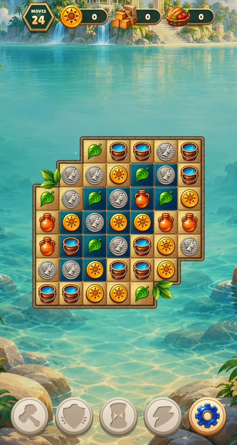
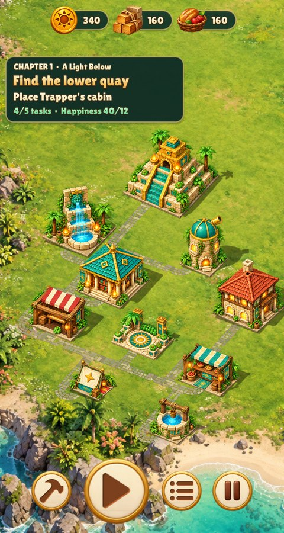
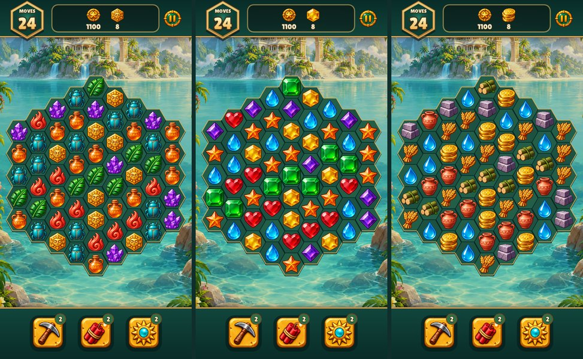

# Relic Rush · The Lost Valley

From the repository root, `make -C games/relic-rush ios` builds, signs, installs
and launches on a connected iPhone. The native iOS target is iPhone only.
Set `DEVICE="name or UDID"` to select one.
See the [device deployment guide](../../tools/xcode/README.md#deploy-to-a-connected-iphone-or-ipad).

A portrait mobile-first square match-3 / island-restoration prototype, written in C11 on the repository's shared platform engine ([`engine/`](../../engine)), the same engine that runs [Nile Archive](../nile-archive). The island is the engine's `city`; text, shapes, input, camera, saves and sound come from the engine; this folder holds the rules, the content and the look. The WebAssembly preview runs the same C code; the browser page is only a fullscreen canvas.

The illustrated title screen opens on every launch. Choose Continue, then Play
on the epoch medals screen to start The Landing on a fresh profile.
Swap adjacent pieces, match horizontally or vertically, and clear the turquoise
plaques within the move budget. Claim the resources to visit the island, then
tap Build to see the next restoration. Each board uses five piece kinds and
fits inside a 9 × 12 square grid.

Continue returns to the campaign, and Settings opens Sound, Reduce Motion, the guide and the leaderboard.
Use **Main Menu** in Settings to return to the title. See the [title screen](docs/screenshots/main-menu.jpg)
and [phone layout](docs/screenshots/main-menu-phone.jpg).

The first four expeditions use text and board highlights to teach swaps, Line Gems, Rainbow Gems
and chains. Tool tips show how to charge and use each tool when you earn it.
See the [guided lessons](../../docs/PORTRAIT_GAMES.md#guided-board-lessons).

The building popup centers a large preview above its description and pairs the
price or shortfall with the board reward. The preview and resource icons follow
the panel’s entrance scale, position and opacity. See the
[popup and refill comparisons](docs/review/popup-refill/README.md).

Haptics accompany matches, cascades, trickling landings,
results, income collection, building pickup and release/drop. Moving a preview
requires dragging the building; tapping land does not move it. Confirm and Cancel
add no feedback. See the [shared haptics contract](../../docs/HAPTICS.md).

## Island navigation and resources

The cottage at the lower left opens the next restoration. The card shows the price or the remaining amount of each resource. A trail circles the button when the building is affordable and its level requirement is met. Choose a location and confirm to spend the resources. The card also opens the shop for decorations.

The top wallet shows Coins, Supplies and Food on both screens. Matches
preview in the wallet during an expedition and bank after a successful clear.
The completion dialog shows the expedition score.
The first clear of The Landing pays at least 35 Coins, enough to buy the Spring well before level 2. Later restorations add Food and Supplies, and from the Expedition camp on every purchase uses all three. Boards cleared unlock shop stock and land. There are no lives: a failed
board can be retried at once.

Tap a placed building for its name and subtitle above it. Only one stays open. The next press dismisses it. A stationary hold picks up a building through the shared mover, with Confirm/Cancel preserving saved state.

See the [building label comparisons at both phone sizes](docs/screenshots/review/town-labels/README.md).

Scrolling uses the engine animation clock: a scalar `CAAnimation` drives the iOS timeline, as in CorePunch/orca, while other platforms use the platform monotonic clock.

## Shared match engine and atlas

Match through every turquoise plaque to win. Single and crossed chains mark pieces that absorb one or two hits before a match clears the plaque beneath them. The last few plaques get a trail around their square edges during idle play. Papyrus fills the ordinary cells. The rounded sandstone rim has a dark lip along the board and alternates leafy and bare inset corners. The [square campaign guide](docs/square-match3.md) lists the boards and tiles.

The [engine match-3 module](../../docs/MATCH3_ENGINE.md) owns all matching,
swaps, blockers, trickling gravity, cascades, hints, tools and board
input/timing. This game provides campaign data, graphics and integer behavior
flags. Every exposed column top (no active cell directly above) spawns gems
vertically. Interior gems fall straight down whenever their cell below is
empty and movable, and slide diagonally only when that cell is occupied,
locked or missing. Locks still route gems around their sides.

The board's art is one atlas per kind in `data/board/`: `pieces.png`,
`blockers.png`, `cells.png`, `hud.png` and `fx.png`. Its backgrounds are separate JPEGs in
`data/board/backs/`. The small HUD icons share `pieces.png` with the board
pieces, and the jade signboard lives in `hud.png`.
`python3 tools/match3_atlas.py` rebuilds the atlases from
the registered sprites in `art/registered/`; [Asset layout](../../docs/ASSET_LAYOUT.md)
describes the folders.
`--default-match3` previews the engine's neutral skin.


## Screenshots

Captured from the engine build with `make shots` (headless, software renderer). Island images use demonstration progress to show the settlement and placement tools.

| Square expeditions | Restored island |
| --- | --- |
|  |  |
|  |  |
|  |  |
|  |  |

## Languages

The game is written in English and translated into German, Spanish, French,
Italian, Brazilian Portuguese, Russian, Japanese, Korean and Simplified Chinese
(`data/common/l10n/`). It follows the device's language; `--lang ja` picks one.
Mark new player-visible text with `tr` and translate it in every catalogue:
see [docs/LOCALIZATION.md](../../docs/LOCALIZATION.md).

## Leaderboard

The LEADERBOARD link in Settings opens the overall rankings by expeditions cleared. The game updates
the total when the player claims a first-clear reward. The dialog shows Everyone and Friends tabs,
player portraits and the player's own row. When offline, it shows the player's best total.

| Settings | Expeditions cleared |
| --- | --- |
|  |  |


Use `com.corepunch.relicrush.stars` in [Game Center](../../docs/GAMECENTER.md). Capture the dialog
with sample rivals using `--gamecenter-demo --dialog leaderboard`.

The Landing starts with gold coins, silver coins, leaves, flowers and amphoras. Water, timber and a bonus piece take existing slots once their buildings are confirmed.

Clear every turquoise plaque to finish the expedition. Tavi, Oren and Sela come ashore in a short scene before the first expedition; the rest of the [script](docs/story.md) is archived. **Story** in Settings turns the scene off.

## Shared UI and dialog layers

The island and the board share one wallet and Settings bar. The green resource
capsules have the same brass rim and drop shadow as the round buttons. A circular Moves
counter sits at the left of the resource balances and turns red at five
moves. Blue tablets mark the board objective. Winning banks the resources
earned in the three slots.
Four large circular bonus sockets sit beside a smaller Settings gear below the board from the first
expedition. Settings opens the Explorer's Guide,
and Results shows the score and rewards. Full-size popup actions use raised gold or ochre stone buttons. Small actions use text, and the corner X sits on red enamel. The build catalogue lists buildings directly on the scroll. Results show outlined resource icons and figures. Popup cards lift and fade in over a
dimmed background, then drift down as they close. The board fades away before
the win or loss card arrives. Reduce Motion skips these transitions.
See the [top bar review](docs/screenshots/review/top-bar-moves/README.md)
and [shared UI API](../../docs/UI_ENGINE.md).


## Result screens and typography

The expedition result shows earned resources and Collect & Return. Above the Build house, each icon shows how much of that resource the next restoration still needs. When the price and level requirement are met, a particle trail circles the house. Tap it for the restoration card and its reward. Reduce Motion hides the trail. [Square build review](docs/square-match3.md#captures).

Text is aligned by its visible ink bounds (the engine's `text_in`), shared by buttons and counters, and paragraphs wrap into balanced lines (`text_box`).


Dialogs arrive and leave on the engine's motion module ([docs/MOTION.md](../../docs/MOTION.md)): the card eases in and the parts of the result settle on one timeline, which the first tap skips.

See [UI architecture, Playrix/Candy Crush references and regression checks](docs/ui-results-and-type.md).

## Effects and motion

Coloured match fragments, resource trails and cascade chimes follow each clear. During refills, each gem gives a small bounce when it comes to rest in its slot. Reduce Motion suppresses the bounce. The result screen counts the score up. The 0.7-second wipe from the island reveals the board as it assembles. The HUD lands, cells ripple out from the centre, relics drop and bounce, blockers slam on and a sheen runs across the board. Tap to skip the entrance. Reduced motion uses a short fade. See [the board entrance](../../docs/ENGINE.md#board-entrance).


See [effect reference study](docs/effects.md). The reel uses deterministic test boards; actual iPhone/Android performance still needs device testing.

## Current match-3 rules and boards

The widest board uses nine 48-unit square cells across a 480-unit design. Match three or more in a row or column. A long or crossing match clears each participating piece once. The five matching kinds stay on the board through refills. The ten masks and move budgets live in [campaign.lua](lua/campaign.lua).

After five idle seconds, a legal swap is highlighted. If there is no legal swap, the board reshuffles for free and displays “No moves. Board reshuffled.” This recovery also runs after cascades. Movable pieces fly to their new cells during either a free shuffle or a Mixer use. Locked pieces and blue tablets stay put. Reduce Motion settles the pieces immediately. See the [dead-board regression and captures](docs/review/dead-board/README.md).

Power comes only from the bonus tools: matched bonus gems fly into their sockets and reveal the colored pieces from the bottom.
With Reduce Motion on, the charge appears immediately.
Empty buttons show the tool recessed into sandstone, with a soft shadow along the upper-left edge.
See the [bonus artwork and state review](docs/asset-catalogue.md#campaign-bonus-pieces-and-sockets).

See [matching rules, board shape and implementation notes](docs/square-match3.md). The [hex rules](docs/match4-rules.md) record the previous campaign.

## New art direction

The first match-3 board overlooks the expedition landing. Each of the 20 campaign
restorations introduces a portrait painting of that site on eligible boards once
the player confirms construction. Replays use the same expedition gates.
See the [backdrop catalogue](docs/asset-catalogue.md#construction-backdrops).

## Expedition and restoration loop

1. Start directly in the first match-3 level; there is no title-screen or friend-road detour.
2. Clear all turquoise plaques within the move budget.
3. Claim the matched resources. A first clear counts as a cleared board.
4. Collect and play the next expedition. When a restoration opens or becomes affordable, Collect takes you to the island. Tap Build to see projects grouped by epoch and select one for its cost. A particle trail marks Build when any eligible project is affordable.
5. Confirm construction, pan across the growing settlement and open neighboring land when eligible.
6. Construction adds a new resource piece or tool to later boards. The campaign has twenty restorations across five epochs.

A matched sun coin earns 5 Coins and a silver coin 3. Leaves, flowers and amphoras add score only.
The Spring well's water buckets earn Food from expedition 2. The Trapper's cabin introduces Hammer, and the Carpenter's workshop introduces timber worth Supplies. Buying the Expedition camp replaces Hammer with Bomb. The construction card explains what the building does and shows its piece or tool beside the price or amounts still needed.

### Tutorials and upgrades (`lua/user_events.lua`)

[`lua/user_events.lua`](lua/user_events.lua) ports Cradle of Rome's
`settings/user_events.xml`. It uses the same event ids, `If` conditions,
`Then` effects and `available` chaining. The runtime is the engine's
([`match3/user_events.lua`](../../engine/lua/match3/user_events.lua), shared with
Christmas Market; see [the match-3 engine](../../docs/MATCH3_ENGINE.md#user-events-and-upgrades));
[`lua/user_events_runtime.lua`](lua/user_events_runtime.lua) only wires it to this
game. Each event fires once per profile, and the save keeps which events are done.

- **Tutorials.** The move hint repeats with the board's 1st, 2nd, 3rd and
  5th suggestion until the first line of three. Toasts introduce tablets,
  double tablets, chains, double chains, ice, the low-moves warning, each
  charged bonus and the catalogue.
- **Upgrades.** Sixteen, with Rome 2's ids `man_01` to `man_16` (Rome's citizens, kept by the
  cast we know; [the table](../../docs/CAMPAIGN_DESIGN.md#upgrades-romes-citizens-kept-by-the-cast-we-know)):
  a second rope and pulley at the Spring well (Oren), a second saw bench at the Carpenter's workshop
  (Sela), a bronze reflector at the Lighthouse (Tavi) and so on. Placing the building arms its feat (a resource
  earned in one level, a long match or a run of moves); meeting it upgrades the building, awards a trophy and gives
  a lasting perk: more Coins, Food or Supplies in every won expedition, or a tool whose pieces charge one point
  more per match. The building's card shows the feat while it is armed, then "Upgraded: ..." with the perk. The scene,
  spoken by the keeper, is the upgrade's entry in `docs/story.md` under `## Upgrades` and plays on the next return to
  town (a toast if it is missing).
- **Test flag.** `--user-events-test` fires the `test=true` events at once,
  like Rome's F5 cheat.

The building upgrade is recorded but has no art yet.

## Campaign

The 100 square boards are authored in `lua/campaign.lua`, five epochs of twenty levels. Each board has a tier: levels 1–4 teach, then every ten levels run easy, easy, normal, normal, hard, easy, normal, normal, hard, boss. Single chains arrive on level 4 and double chains on level 9. `python3 tools/square_boards.py relic-rush` validates the boards, `tools/square_trim.py` fills and trims their plaques to the tier target and `tools/tune_moves.py` fits their move budgets. Every tier starts from the median clear × 1.25, rounded up. Relic Rush multiplies that result by 1.5 and rounds up again. Slow bot samples do not raise the budget. The [previous hex campaign](docs/board-progression.md) records the earlier layouts.

## Buildings

The town lists the current epoch's four projects at the upper left: a
numbered row each (a tick once built), with "Ready to build!" under one you
can afford and Build's particle trail circling its number. The first time a
project can be built, Sela says so and points at the list, which stays sharp
above the dialogue's dim (`town_tip` in `lua/game_config.lua`, shown once). Tap a row to place a ready
project or open its card.

Build opens the shop at the current epoch: its four projects first, then the
decorations. Each row shows the building's art, its name with the icon of
what a project brings, a line about it and its price on one line (an amount
you cannot yet cover in red). A lock or a
tick over the art marks a locked or built one, and a row you cannot build yet
is faded. A particle trail circles Build when a project is
affordable. A row that can be bought goes straight to placement; a project
still out of reach opens its card with the shortfall. The triangular Play button shows the next expedition
between Build and Pause. The next epoch opens after the current one’s
20 expeditions and four projects.

[Compare all twenty rewards with Christmas Market and Cradle of Rome 2](../../docs/cradle-of-rome-reference/building-rewards.html).

Each epoch offers four projects. Once the first expedition is complete, you can build any project in the current epoch that you can afford. Catalogue order follows the Windows edition of Cradle of Rome 2 (Rome names are in brackets). The levels in the table are the [balance targets and board reward milestones](docs/square-match3.md#construction-balance). Once a building is confirmed and its reward's milestone has passed, its piece or tool can appear on the board.

| Target clear | Restoration | Reward | Coins / Food / Supplies |
| ---: | --- | --- | --- |
| 1 | Spring well (Well) | Water buckets | 35 / 0 / 0 |
| 6 | Trapper's cabin (Hunter's Hut) | Hammer | 655 / 240 / 0 |
| 11 | Carpenter's workshop (Sawmill) | Timber | 1515 / 565 / 0 |
| 16 | Expedition camp (Village) | Bomb | 1680 / 640 / 725 |
| 21 | Jungle market (Farm) | Ration jars | 1580 / 595 / 880 |
| 26 | Stone trading post (Quarry) | Dressed stones | 1180 / 990 / 890 |
| 31 | Water mill (Mill) | Grain bundles | 960 / 1175 / 1145 |
| 36 | Tide clock tower (Thermae) | Shield | 880 / 1270 / 1140 |
| 41 | Harbour plaza (Port) | Shrimp | 945 / 1455 / 1265 |
| 46 | Harbour lodge (Curia Octavia) | Hourglass | 895 / 1710 / 1170 |
| 51 | Stone amphitheatre (Coliseum) | Helmets | 850 / 1785 / 1150 |
| 56 | Cartographer's house (House of the Vestals) | Lightning | 915 / 1760 / 1120 |
| 61 | Keeper's archive (Aqueduct) | Rings | 930 / 1775 / 1100 |
| 66 | Lighthouse | Plus | 1020 / 1730 / 1060 |
| 71 | Beached schooner (Nero's Golden House) | Scarabs | 1165 / 1845 / 1150 |
| 76 | Star observatory (Mausoleum of Augustus) | Mixer | 1280 / 1855 / 1160 |
| 81 | Great aviary (Pantheon) | Sandals | 1585 / 2250 / 1425 |
| 86 | Relic museum (Theatre) | Harps | 1755 / 2215 / 1455 |
| 91 | Temple of the Sun (Forum) | Star | 2045 / 2400 / 1525 |
| 96 | Jade fountain (Fountain) | Emeralds | 2120 / 2375 / 1485 |

A new game starts with the crew's free Supply tent in the center of the Harbor glade clearing. It moves like any other building. Players may continue expeditions while saving for construction. The shop offers repeatable scenery alongside the campaign buildings. Pick a row with a price you can cover, then choose a location and
confirm. Cancelling is free. The resources
needed for an earned restoration are reserved until placement. Purchases save
and move like wonders, with a 160-object island limit. See the complete
[building catalogue](docs/building-catalogue.md) and
[in-game review](docs/review/building-catalogue/README.md).


## Island regions

The 1920 × 2880 world scrolls beyond the phone screen. Hidden six-neighbor land tiles define connected regions, while placement itself uses continuous world coordinates. The puzzle grid and island territory graph are separate systems.

| Region | Opens in |
| --- | --- |
| Harbor glade | Epoch I |
| Sunlit coast | Epoch II |
| Fern meadow | Epoch III |
| Sun garden | Epoch IV |
| Ancient heights | Epoch V |

Harbor glade is open from the start. Each new epoch opens its district once
its predecessor’s twenty expeditions and four projects are complete. Tap a
question mark to see which epoch opens that district. Swipe to coast across
the island, with a gentle rebound at the edge.

## Play

- Swap adjacent pieces to make a straight line of three or more identical pieces along rows or columns. Four in a line leave a line gem of that color, which sweeps its row or column when matched, and five leave a rainbow gem that clears one kind. Crossing lines make no bomb. The bonus tools, charged by matching bonus gems, follow Cradle of Rome.
- Match or land a tool hit on a chained piece to break the chain. A later hit clears a blue tablet on that cell. Ice and carved stones are other blockers; they gate the fall below them.
- Cascades increase score multipliers. Gathered resources animate toward their wallet slots. The result screen shows the matched resource totals and, as icon amounts, what the next restoration still needs.
- Restore buildings to unlock four bonus families. A later restoration
  upgrades each of the four slots and carries its charge forward. An expedition
  can feature one bonus gem family. Matching 30 fills one use, and activation
  costs zero moves. [Bonus effects and restorations](docs/board-progression.md#bonus-pieces)
- Idle hints, automatic dead-board recovery, restart on failure, pause with Restart (confirmed), Quit to Island, and Sound and Reduce motion checkboxes.
- Each won attempt banks what the crew brings back. First clears count toward boards cleared. Restoration progress follows confirmed placement.
- Large scrollable island, five connected land regions defined by a hidden hex tile graph. Drag the map to pan, even when the gesture starts on a building; pinch to zoom (or use the mouse wheel on desktop).
- Locked districts open with their epochs.
- The settings gear sits beside the three resource balances. Buildings, Play and Expeditions occupy the town's bottom row. Both catalogues scroll continuously. The building shop shows one building per row.
- Choose any valid grassy position within opened land. Hold a placed building still for half a second to pick it up, then drag and confirm or cancel. The building shows no label; it turns semitransparent red where it can't go. Completed buildings can be moved without spending resources. Preview and cancellation never change the saved layout.
- Footprint collision and shoreline checks prevent overlap and water placement. Automatic connector roads are disabled.
- Progress saves after rewards, construction and region unlocks (a `key=value` file in the per-game preferences folder, or `localStorage["relic-rush/progress"]` in the browser). An unfinished board restarts if the application is closed.

## Selected tile art

The [artwork and state catalogue](docs/asset-catalogue.md) inventories every gem
pack, chain, tool and animation state, with source and runtime paths.
`--art-states` shows the collection and `--art-board` previews the shared
engine’s board pieces for development. Catalogue coverage runs in `make test`.

The campaign uses one [painted atlas](docs/asset-catalogue.md#campaign-piece-atlas)
for resources, upgrades and story pieces. The **Jewels** and **Resources**
art previews remain available through `--tiles jewels` and `--tiles resources`.
See the [tile-set comparison and construction research](docs/tile-sets.md).
The [Cradle of Rome gem sheet](../../docs/cradle-of-rome-reference/gem-correspondence.html)
shows both games’ pieces and payouts side by side.

Use `--rome-reference-art /absolute/path/to/game_graphics` to compare the
extracted Cradle of Rome 2 chips in a local run. Point it at the directory with
`gmbn_5.png`. The shipped resource art remains in the game data.



## Run and build

From the repository root (system platform development files needed for native builds, the Emscripten SDK for the web):

```sh
make run-relic                                  # native desktop
make test                                       # rules, island and engine tests
make web && python3 -m http.server 8080 --directory dist   # http://localhost:8080/relic-rush/
```

The game is laid out for a 480 × 900 portrait screen inside the device's safe area. It is `fixed` with `max_aspect = 2.2`, so on taller phones the screen keeps its width and grows taller (`R.layout()` moves the bottom group down by the extra height, `R.drop`). Its jungle backdrop, the island and the HUD bands run on under the status bar and the home indicator to the screen edges (`app.bleed()` / `gfx.bleed`). Runtime art in `data/` is committed; `python3 games/relic-rush/tools/prepare_assets.py` rebuilds it from the sources in `art/` (needs Pillow).

Debug and capture options (no progress is written): `--level N`, `--city N` (an island after N expeditions; `--open MASK` limits it to those regions, bit per region), `--epoch N` (an island once N epochs of four ladder purchases are bought), `--look X,Y` (centre the island camera on a world point), `--showcase`, `--overview`, `--catalogue`, `--catalogue-page N`, `--catalogue-item ID`, `--catalogue-card ID`, `--shop-card ID` (an item's card before it is bought), `--building-review N` (four catalogue objects per footprint review page), `--footprints` (every building's footprint and pivot over its sprite), `--placing [blocked|dragging]` (`blocked`: the red ghost over a built wonder; `dragging`: the ghost held up between tiles over the footprint of the tile it will land on), `--zone N`, `--card N`, `--victory`, `--dialog guide|pause|failed|finale|intro|mara|tomas|adrian|bubble|leaderboard`, `--tiles relics|jewels|resources`, `--art-states`, `--art-board`, `--fx shatter`, `--smoke` (plays level one through injected clicks, claims, builds, checks pan/long-press move/cancel/confirm and enters level two), plus the engine's `--shot file.png --frames N`, `--size WxH`, `--fresh` and `--mute`.

## Controls and saved progress

- **Board:** swipe to one of four neighbors, or tap two adjacent relics. Tap a charged socket and then its target. Plus activates as soon as you tap its socket. The top-right medallion pauses: level details, a Sound and Reduce motion group, Resume, Restart (asks first), Quit to island (keeps the board) and the guide; Escape does the same. Tap outside a closable popup to dismiss it; results require an explicit action.
- **Island:** drag the map to pan, including from buildings; pinch or use the mouse wheel to zoom. Tap a building for its card, or hold it still for half a second to pick it up and move it. Tap clouded land to see what opening it needs.
- **Epochs:** Continue from the main menu shows the five medals. Play resumes the current epoch. Finish twenty boards and four projects to reveal the next district and see the medals again.
- **Placement:** choose a grassy spot, check the green/red footprint, then confirm or cancel. Leave a tile of open ground between building bases. Footprints cannot cross the shoreline or occupy closed land. Moving a completed building is free.
- **Save:** level progress, resources, opened regions and building positions persist; an unfinished puzzle restarts. Saves of the standalone prototype (`progress.txt`, `localStorage["relic-rush-v1"]`) are not imported.

## Verification

- `make test` runs the original rule regressions, ported: grid invariants, straight lines and rejection of bent, diamond and ring groups, holes and diagonal trickling, chains, tool targeting, playable opening boards, reward claims and construction. The extended campaign test runs with `make test-extended`. The greedy bot must win every board at least once in its seeds, without tools.
- `--smoke` opens and closes the data-backed guide, then drives the real game loop with injected mouse clicks through swaps, cascades, the win dialog, the claim, construction, pan/long-press pickup/cancel/confirm and the start of level two.
- `--smoke --campaign` plays the 100 expeditions through the real result, Collect, region, placement and Play controls. Each board's goals are met before one real swap. The run checks that play stays free of dialogue and ends after the completion card with all twenty purchases placed. It runs in `make test-full` (CI), or alone with `build/test/relic-rush "smoke campaign"`.
- Every screenshot above is rendered by the same code; they were compared side by side with captures of the standalone prototype.
- iPhone and Android device builds, touch feel, safe areas and performance still need device QA.

## Art and text pipeline

Nine matching landmarks have independently registered ground shadows below the
current painted sprites. The courtyard and all 86 repeatable catalogue entries
are preserved. See [building registration](docs/BUILDINGS.md) and the
[reviewed captures](docs/review/painted-buildings/README.md).

Original generated environment paintings, the legacy 10-building sprite sheet and the 6 × 3 tile sheet (`art/tile-sets/source.png`: the Relics, Jewels and Resources packs) are kept as editable sources in `art/`. The 97 current building sprites use the Blender-guided ImageGen atlas and `tools/prepare_buildings.py` (see the building catalogue). `tools/prepare_assets.py` cuts the other sprites out of their sheets (largest opaque component, so neighbouring paintings never leak in), scales backgrounds to what the screen needs and writes PNG/JPG files the engine loads directly. `docs/references.md` records reference research and provenance. Generated art is a prototype asset set and needs an art consistency / IP review before a commercial release.

Fonts: **Lilita One** for the game UI, rendered at runtime by the engine (TrueType with outline, gradient and drop shadow, any Unicode — Cyrillic localisation no longer needs a new atlas); **Lobster** made the gold `title.png` logo and stays in `art/fonts`. Both are unmodified SIL OFL 1.1 fonts with their license text.

## Source layout

Relic Rush and Christmas Market are one game with two skins
([docs/PORTRAIT_GAMES.md](../../docs/PORTRAIT_GAMES.md)). The flow around the
board, every dialog, the shop, the town hooks, story delivery,
effects and the debug entry points are the engine's (`engine/lua/match3/game.lua`,
`engine/lua/match3/vfx.lua`, `engine/lua/match3/debug.lua`); this folder is data and art.

- `lua/game_config.lua`: shared screen copy, board appearance and piece mappings, the piece packs and the dialogue scale.
- `lua/town_config.lua`: the town screen's layout and notices.
- `lua/state.lua`: the shared state table (`R`) from the engine.
- `lua/art.lua`: named authored states, control-state selection and the in-game catalogue.
- `lua/rules.lua`: piece identities, the economy slots and rewards over the engine's match-3 rules.
- `lua/campaign.lua`, `lua/story_content.lua`, `lua/buildings.lua`, `lua/building_sprites.lua`: levels, the script and the building catalogue.
- `lua/journey.lua`: the restoration schedule, recap and changing tap lines.
- `lua/narrative.lua`: the cast.
- `lua/island.lua`: shoreline, the hidden hex region map, region adjacency and the ten story restorations as engine building definitions.
- `engine/lua/match3/screen.lua`: the board screen shared with Christmas Market.
- `lua/screens.lua`: the results card, the guide's rows and icons, and the wallet and compass icons.
- `lua/skin.lua`: the look as data (`ui.skin`).
- `lua/main.lua`: loads the modules and returns the engine's app descriptor.
- `lua/smoke.lua`: the `--smoke` run through injected input, including the engine's `city.move_test`.
- `art/`, `data/`, `docs/`, `tools/`: sources, runtime assets, documentation and the asset pipeline.

## Design references and original assets

- **Cradle of Rome:** excavating puzzle terrain and spending collected resources on visible restoration.
- **Candy Crush:** an earlier reference for animated reward feedback.
- **June's Journey / Pearl's Peril (Wooga):** a large island, player-selected building locations and land expansion, replacing a linear friend-road progression map.
- **Supercell games:** readable building silhouettes, polished resource feedback and a cheerful settlement presentation.
- **Settlers II / Return to the Roots:** a reference for territory represented by small connected land cells. No road-management system or GPL implementation was copied into the game.
- **Canva-style text effects:** inspiration for layered, image-like lettering with gradient fill, a unified outline and shadow.

See [reference research and source links](docs/references.md) and [art prompts and screenshot provenance](docs/art-prompts.md). The island and buildings are original generated prototype artwork; no ripped commercial game assets are bundled. Font licenses are included alongside the font files. Bundled font licenses apply to the fonts. The repository’s existing top-level `LICENSE` is preserved.

## Roadmap and prototype boundaries

Ideas discussed for later development:

- More decorations, alternative buildings, upgrade choices and a richer restoration economy.
- An expedition journal, characters, narrative events and story scenes built around the Lost Valley premise.
- Visiting friends' settlements; optional asynchronous raids were discussed as an exploratory idea, not an implemented or committed feature.
- Backend accounts, cloud saves and social progression if those features are pursued.
- Human playtesting, campaign balancing, sound design, haptics and more responsive device-specific polish.
- Localization; app icons, safe-area validation, mobile performance checks and signed iOS/Android releases. The standalone prototype's Android/iOS host projects were not carried into this repository; mobile packaging is to be set up once for the shared engine.

The offline prototype has 100 square boards, twenty campaign purchases, repeatable scenery, five regions and local saves.

## Fast rule tests

Run `make test-relic-rush` from the repository root for this game's tests in one command. The Lua suites use deterministic state injections and need no window or artwork. See [the testing guide](../../docs/TESTING.md) for coverage, test-only `ENGINE_TEST` hooks, extended samples and renderer smoke checks.

Board artwork fills its registered square slots. Dialogue portraits slide/fade in and out, and only brighten/dim on speaker changes; no resizing, rotation or idle wobble; the engine owns those transitions. See [motion review](../../docs/review/motion/README.md).

Level entrances provide grouped haptic ticks as gems land and a stronger pulse for
blockers. The touch opening a level cannot skip its entrance; a new tap during
the entrance can. Reduced motion and skipped entrances omit these landing effects.
Building previews show a round × on the lower left and ✓ on the lower right of
the building. Dragging, panning and zooming keep these controls with the preview;
✓ is disabled on blocked land. Cancel preserves the original building and wallet.
Popups (Pause, results, guide, cards) and their backdrops appear and close
immediately, with no entrance or exit motion; only `--reel` captures still play
the results parts.

Frozen pieces retain a centred **1**/**2** counter above the board layers. Selection uses
a soft mint glow; hints use gold light and sparkles. See the updated Explorer’s
guide.

While moving or placing a building, cream outlines around other buildings show
their occupied ground and clearance for quick alignment. The mover's old spot is
free; guides remain until Confirm/Cancel. See the
[shared placement-guide review](../../docs/review/city-placement-guides/README.md).

## Town screen

The island is the engine's [shared town screen](../../docs/TOWN.md), laid out by
`lua/town_config.lua`. Tapping a building shows its name in a word bubble; holding
it for half a second lifts it to move.

The town row draws Build, Play, Levels and Pause as enamel buttons sized to their
slots. A single [painted strip](../../art/match3-buttons/README.md) supplies the
128×128 action icons. The board draws its own bonus pieces on the same buttons.

For a local construction walkthrough, launch `./build/relic-rush --debug-walkthrough`.
Tap **Skip level** at the top right of the board, read any scene, then claim the usual reward.
On the island, **Advance** places an earned campaign building or starts the next board.
The walkthrough has its own save. Add `--fresh` to start at the opening without saving.

### Board

Two straight axes and five pieces form the square board. Papyrus cells and rounded sandstone trim define the playable outline.
